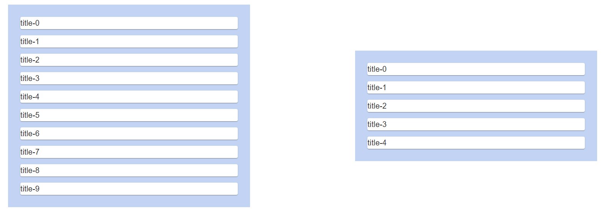

# estella-two-column-dnd

> Two column layout with drag and drop, using react beautiful dnd and material ui for layout

[](https://www.npmjs.com/package/estella-two-column-dnd) [](https://standardjs.com)

## Install

```bash
npm install --save estella-two-column-dnd
```

## Usage
```jsx
import React from "react";
import { TwoColumnDnD } from "estella-two-column-dnd";
import { Card, Typography } from "@material-ui/core";

const getItem = index => {
  return {
    title: `title-${index}`,
    id: index
  };
};

const getItems = n => {
  return Array(n).fill(null)
    .map((item, index) => getItem(index));
};

const App = () => {
  return <TwoColumnDnD
    firstListItems={getItems(10)}
    secondListItems={getItems(5)}
    forbiddenIndexes={[0, 15]}
    itemRender={(item) => (<Card style={{margin: '1em'}}><Typography variant="h6">{item.title}</Typography></Card>)}
  />;
};

export default App;
```

Sample code renders this view:


## Props

<table>
<tr>
<td>Prop name</td> <td>Destination</td> <td>Type</td>  <td>Is required</td> <td>Default</td>
</tr>

<tr>
  <td>

`firstListItems`

</td> <td>Items that will be rendered as elements of the first list</td> <td>array[any]</td> <td>✔</td> <td>none</td>
</tr>

<tr>
  <td>

`secondListItems`

</td> <td>Items that will be rendered as elements of the second list</td> <td>array[any]</td> <td>✔</td> <td>none</td>
</tr>

<tr>
  <td>

`gridOptions`

</td> <td>To make nice two column format, we've used Material-UI Grid component. If you want to customize this grid, provide grid options, corresponding to those in example</td> <td>object</td> <td>✖</td>
  <td>

```json
    gridOptions: {
    firstList: {
      xs: 6,
      sm: 6,
      md: 5,
      lg: 5
    },
    break: {
      xs: false,
      sm: false,
      md: 2,
      lg: 2
    },
    secondList: {
      xs: 6,
      sm: 6,
      md: 5,
      lg: 5
    }
  }
  ```

</td>
</tr>

<tr>
  <td>

`listStyle`

  </td> <td>Object that represents style for both lists</td> <td>object</td> <td>✖</td> <td>none</td>
</tr>

<tr>
  <td>

`warningFunction`

  </td> <td>

Function that fires, when someone wants to proceed with [forbidden action](#forbidden-actions)</td> <td>function</td> <td>✖</td> <td>none</td>
</tr>

<tr>
  <td>

`secondListWarningFunction`

  </td> <td>Function that fires, when someone wants to add item to second function and [second list protection](#second-list-protection) is enabled</td> <td>function</td> <td>✖</td> <td>none</td>
</tr>

<tr>
  <td>

`itemRender`

  </td> <td>Function for rendering item</td> <td>function</td> <td>✔</td> <td>none</td>
</tr>

<tr>
  <td>

`forbiddenIndexes`

  </td> <td>

Array of two values that represent indexes from [forbidden actions](#forbidden-actions)</td> <td>array[number]</td> <td>✔</td> <td>none</td>
</tr>

<tr>
  <td>

`shouldBlockAddingToSecondList`

  </td> <td>

Value that blocks additions for [second list](#second-list-protection)</td> <td>bool</td> <td>✖</td> <td>none</td>
</tr>

<tr>
  <td>

`shouldRemoveFromSecondList`

  </td> <td>

Value that allows deletions from [second list](#second-list-protection)</td> <td>bool</td> <td>✖</td> <td>none</td>
</tr>

</table>


### Forbidden actions
As our business logic required, items from lists cannot be dragged wherever. For example, first and last items from the first
list cannot be moved. To accomplish this task, we've added a prop called `forbiddenIndexes`. It's an array of two numbers.
For example, if it's set as [2, 5], elements to index 2 and from index 5 cannot be moved (includes trying of adding another
element from second list).

### Second List Protection
As our business logic required, second list is (for us) immutable. To prepare this library for more free usage, we've developed
two values, passed as props:
 - `shouldBlockAddingToSecondList` - when is set to `true`, items from the first list cannot be dropped into the second list
 - `shouldRemoveFromSecondList` - when is set to `false`, items from the second list cannot be removed from this list

## License

MIT © [Davenury](https://github.com/Davenury)
